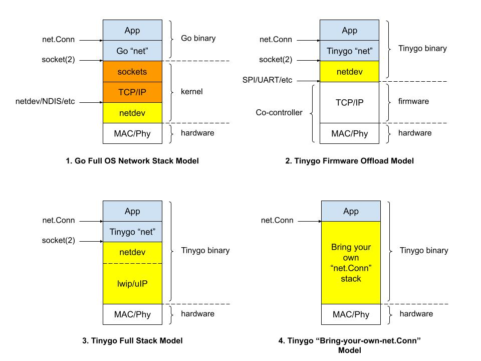

# Netdev

#### Table of Contents

- [Overview](#overview)
- [Using "net" Package](#using-net-package)
- [Using "net/http" Package](#using-nethttp-package)
- [Using "crypto/tls" Package](#using-cryptotls-package)
- [Using Raw Sockets](#using-raw-sockets)
- [Writing a New Driver](#writing-a-new-driver)
 
## Overview

Netdev is TinyGo's network device driver model.  

Let's see where netdev fits in the network stack.  The diagram below shows the traditional full OS stack vs. different possible embedded stacks for TinyGo.  Notice the application is written to the same net.Conn interface for all cases.



In the (1) Go full OS stack, the network driver, aka netdev, sits above hardware (the "nic") and below TCP/IP.  The netdev provides a raw packet interface to TCP/IP.

For TinyGo, the netdev includes TCP/IP and provides a socket(2) interface to the "net" package.  Applications are written to the net.Conn interfaces: TCPConn, UDPConn, and TLSConn.  net.Conn functions call netdev socket(2) calls, which in turn call into firmware/hardware.  Let's consider the three use cases:

#### (2) Firware Offload Model

Here the networking device is a co-controller installed with firmware running a full TCP/IP stack.   Firmware manages the TCP/IP connection state with the network.

The netdev driver runs on the main controller and talks to the co-controller's firmware interface using UART/SPI/etc.  The netdev driver translates socket(2) calls to the firmware's TCP/IP calls.

The wifinina (ESP32), espat (ESP32-AT), and rtl8720dn netdev drivers are examples of the firmware offload model.

#### (3) Full Stack Model

Here the netdev includes the TCP/IP stack.  There is no co-controller. 

#### (4) "Bring-Your-Own-net.Comm" Model

Here the netdev is the entire stack, accessing hardware on the bottom and serving up net.Conn connections to applications.

## Using "net" Package

Ideally, TinyGo's "net" package would be Go's "net" package and applications using "net" would just work, as-is.  TinyGo's net package is a partial port from Go's net package, replacing OS socket syscalls with netdev socket calls.  TinyGo's net package is a subset of Go's net package.  There are a few features excluded during the porting process, in particular:

- No IPv6 support
- No HTTP/2 support
- No TLS support for HTTP servers (no https servers)
- No DualStack support
- HTTP client request can't be reused

Run ```go doc -all ./src/net``` on tinygo directory to see full listing.

Applications using Go's net package will need a few setup steps to work with TinyGo's net package.

### Step 1: Create the netdev for your target device.

The available netdev are:

- [wifinina]: SPI to ESP32 WiFi co-controller running Arduino WiFiNINA firmware

	targets: pyportal arduino_nano33 nano_rp2040 metro_m4_airlift arduino_mkrwifi1010 matrixportal_m4

- [rtl8720dn]: UART to RealTek WiFi rtl8720dn co-controller

	targets: wioterminal

- [espat]: UART to ESP32/ESP8266 WiFi co-controller running Espressif AT firmware

	targets: TBD

This example configures and creates a wifinina netdev using New().

```go
import "tinygo.org/x/drivers/wifinina"

func main() {
	cfg := wifinina.Config{Ssid: "foo", Passphrase: "bar"}
	dev := wifinina.New(&cfg)
	...
}
```

The Config structure is netdev-specific; consult the netdev package for Config details.  In this case, the WiFi credentials are passed.

### Step 2: Hook the netdev into the net package

Tell the net package to use the netdev by calling netdev.Use().  Continuing with the wifinina example:

```go
import "tinygo.org/x/drivers/netdev"
import "tinygo.org/x/drivers/wifinina"

func main() {
	cfg := wifinina.Config{Ssid: "foo", Passphrase: "bar"}
	dev := wifinina.New(&cfg)
	netdev.Use(dev)
	...
}
```

Now, the net package is linked to the netdev so any net I/O will go through the netdev.  Calls to net.Dial(), net.Listen() etc will translate to netdev socket calls.

The last step is to connect the netdev to an IP network.

### Step 3: Connect to an IP Network

Before the net package is fully functional, connect the netdev to an underlying IP network.  For example, a WiFi netdev would connect to a WiFi access point or become a WiFi access point; either way, once connected, the netdev has a station IP address and is connected on the IP network.

Call dev.NetConnect() to connect the device to an IP network.  Call dev.NetDisconnect() to disconnect.  Continuing example:

```go
import "tinygo.org/x/drivers/netdev"
import "tinygo.org/x/drivers/wifinina"

func main() {
	cfg := wifinina.Config{Ssid: "foo", Passphrase: "bar"}
	dev := wifinina.New(&cfg)
	netdev.Use(dev)

	dev.NetConnect()
        
	// net package calls here
	
	dev.NetDisconnect()
}
```

Optionally, get notified of IP network connects and disconnects:

```go
	dev.Notify(func(e netdev.Event) {
		switch e {
		case netdev.EventNetUp:
			println("Network UP")
		case netdev.EventNetDown:
			println("Network DOWN")
	})
```
	
Here is a simple http server listening on port :8080, before and after porting from Go "net/http":

#### Before
```go
package main

import (
	"fmt"
	"net/http"
)

func main() {
	http.HandleFunc("/", HelloServer)
	http.ListenAndServe(":8080", nil)
}

func HelloServer(w http.ResponseWriter, r *http.Request) {
	fmt.Fprintf(w, "Hello, %s!", r.URL.Path[1:])
}
```

#### After
```go
package main

import (
	"fmt"
	"net/http"
    
	"tinygo.org/x/drivers/netdev"
	"tinygo.org/x/drivers/wifinina"
)

func main() {
	cfg := wifinina.Config{Ssid: "foo", Passphrase: "bar"}
	dev := wifinina.New(&cfg)
	netdev.Use(dev)
	dev.NetConnect()

	http.HandleFunc("/", HelloServer)
	http.ListenAndServe(":8080", nil)
}

func HelloServer(w http.ResponseWriter, r *http.Request) {
	fmt.Fprintf(w, "Hello, %s!", r.URL.Path[1:])
}
```

## Using "net/http" Package

TinyGo's net/http package is a partial port of Go's net/http package, providing a subset of the full net/http package.

HTTP client methods (http.Get, http.Head, http.Post, and http.PostForm) are functional.  Dial clients support both HTTP and HTTPS URLs.

HTTP server methods and objects are mostly ported, but for HTTP only; HTTPS servers are not supported.

HTTP request and response handling code is mostly ported, so most the intricacy of parsing and writing headers is handled as in the full net/http package.

Run ```go doc -all ./src/net/http``` on tinygo directory to see full listing.

## Using "crypto/tls" Package

TinyGo's TLS support (crypto/tls) relies on hardware offload of the TLS protocol.  This is different from Go's crypto/tls package which handles the TLS protocol in software.

TinyGo's TLS support is only available for client applications.  You can http.Get() to an http:// or https:// address, but you cannot http.ListenAndServeTLS() an https server.

The offloading hardware has pre-defined TLS certificates built-in.

## Using Raw Sockets

A netdev implements the Socketer interface so an application can make raw socket calls, bypassing the net package.

Here is a simple TCP application using raw sockets:

```go
package main

import (
	"tinygo.org/x/drivers/netdev"
	"tinygo.org/x/drivers/wifinina"
)

func main() {
	cfg := wifinina.Config{Ssid: "foo", Passphrase: "bar"}
	dev := wifinina.New(&cfg)
	netdev.Use(dev)
	
	// ignoring error handling
	
	dev.NetConnect()

	sock, _ := dev.Socket(netdev.AF_INET, netdev.SOCK_STREAM, netdev.IPPROTO_TCP)

	sockAddr := netdev.NewSockAddr("", netdev.Port(8080), netdev.ParseIP("10.0.0.100")
        dev.Connect(sock, sockAddr)

	dev.Send(sock, []bytes("hello"), 0, 0)

	dev.Close(sock)
}
```

## Writing a New Driver

Netdev drivers implement the netdev.Netdever interface, which includes the netdev.Socketer interface.  The Socketer interface is modeled after BSD socket(2).  TinyGo's net package translates net.Conn calls into netdev Socketer calls.  For example, DialTCP calls netdev.Socket() and netdev.Connect():

```go
func DialTCP(network string, laddr, raddr *TCPAddr) (*TCPConn, error) {

        fd, _ := netdev.Socket(AF_INET, SOCK_STREAM, IPPROTO_TCP)

        addr := NewSockAddr("", uint16(raddr.Port), raddr.IP)
        
        netdev.Connect(fd, addr)

        return &TCPConn{
                fd:    fd,
                laddr: laddr,
                raddr: raddr,
        }, nil
}
```

### Netdever Interface

A netdev driver implements the Netdever interface:

```go
// Netdev drivers implement the Netdever interface.
//
// A Netdever is passed to the "net" package using netdev.Use().
//
// Just like a net.Conn, multiple goroutines may invoke methods on a Netdever
// simultaneously.
type Netdever interface {

        // NetConnect device to IP network
        NetConnect() error

        // NetDisconnect device from IP network
        NetDisconnect()

        // NetNotify to register callback for network events
        NetNotify(func(Event))

        // GetHostByName returns the IP address of either a hostname or IPv4
        // address in standard dot notation
        GetHostByName(name string) (IP, error)

        // GetHardwareAddr returns device MAC address
        GetHardwareAddr() (HardwareAddr, error)

        // GetIPAddr returns IP address assigned to device, either by DHCP or
        // statically
        GetIPAddr() (IP, error)

        // Socketer is a Berkely Sockets-like interface
        Socketer
}
```

### Socketer Interface

```go
// Berkely Sockets-like interface.  See man page for socket(2), etc.
//
// Multiple goroutines may invoke methods on a Socketer simultaneously.
type Socketer interface {
        Socket(family AddressFamily, sockType SockType, protocol Protocol) (Sockfd, error)
        Bind(sockfd Sockfd, myaddr SockAddr) error
        Connect(sockfd Sockfd, servaddr SockAddr) error
        Listen(sockfd Sockfd, backlog int) error
        Accept(sockfd Sockfd, peer SockAddr) (Sockfd, error)
        Send(sockfd Sockfd, buf []byte, flags SockFlags, timeout time.Duration) (int, error)
        Recv(sockfd Sockfd, buf []byte, flags SockFlags, timeout time.Duration) (int, error)
        Close(sockfd Sockfd) error
        SetSockOpt(sockfd Sockfd, level SockOptLevel, opt SockOpt, value any) error
}
```

Socketer interface is intended to mimic a subset of BSD socket(2).  They've been Go-ified, but should otherwise maintain the semantics of the original socket(2) calls.  Send and Recv add a timeout to put a limit on blocking operations.  Recv in paricular is blocking and will block until data arrives on the socket or EOF.  The timeout value is calculated from net.Conn's SetDeadline(), typically.

#### Locking

Multiple goroutines may invoke methods on a net.Conn simultaneously, and since the net package translates net.Conn calls into Socketer calls, it follows that multiple goroutines may invoke Socketer calls, so locking is required to keep Socketer calls from stepping on one another.

Don't hold a lock while Time.Sleep()ing waiting for a hardware operation to finish.  Unlocking while sleeping let's other goroutines make progress.  If the sleep period is really small, then you can get away with holding the lock.

#### Sockfd

The Socketer interface uses a socket fd to represent a socket connection (end-point).  Each net.Conn maps 1:1 to a fd.  The number of fds available is a netdev hardware limitation.  Wifinina, for example, can hand out 10 socket fds.

### Testing

The netdev driver should minimally run all of the example/net examples.

TODO: automate testing to catch regressions.  
